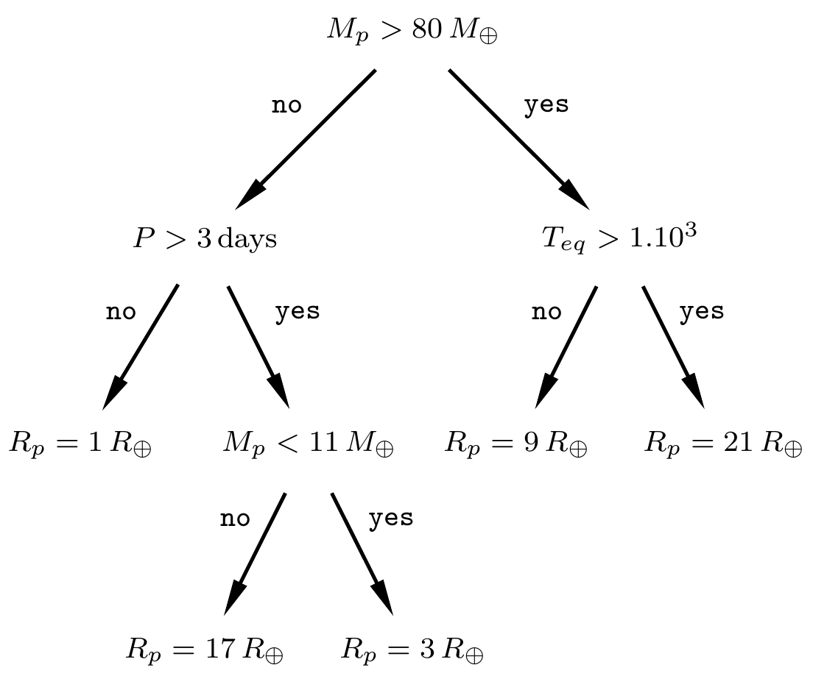

## BEM :  beyond the exoplanet mass-radius relation with random forest
Predicting the radius of exoplanets based on its planetary and stellar parameters

[](https://travis-ci.org/soleneulmer/bem)
[](https://github.com/soleneulmer/bem/LICENSE)

### Branca Edmée Marques
A portuguese scientist who worked on nuclear physics in France with Marie Curie


### To install bem
```bash
pip install bem
```
or
```bash
git clone https://github.com/soleneulmer/bem.git
cd bem
python setup.py install
```

### A simple decision tree
#### to predict exoplanet radius


### How to run bem:
```bash
# Load exoplanet and solar system planets dataset
dataset = bem.load_dataset()
# Plot the dataset radius as a function of mass and equilibrium temperature
bem.plot_dataset(dataset)
```
```bash
# Build the random forest model and predict radius of the dataset
regr, y_test_predict, _, train_test_sets = bem.random_forest_regression(dataset)
```
Predict the radius of your favorite planet

my_planet = [planetary_mass,
             semi major axis,
             eccentricity,
             stellar radius,
             stellar effective temperature,
             stellar mass]
```bash
# Predict a new radius
radius = bem.predict_radius(my_planet=np.array([[1.63,
                                                 0.034,
                                                 0.02,
                                                 0.337,
                                                 3505.0,
                                                 0.342]]),
                            my_name=np.array(['GJ 357 b']),
                            regr=regr,
                            jupiter_mass=False)
```
```bash
# Load exoplanet and solar system planets dataset with uncertainties
dataset_errors = bem.load_dataset_errors()
# Compute the error bars for the test set planets
radii_test_output_error, _ = bem.computing_errorbars(regr,
                                                     dataset_errors,
                                                     train_test_sets)
```
